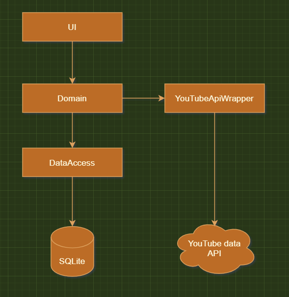

# Architecture of YouTube playlist manager

## Overview

YouTube playlist manager is a tool written to locally store and manage your personal YouTube playlists.

It allows for fast search of your videos, and fast scroll through thousands of videos in a 
playlist (rather than waiting every 100 videos for the 'next page' on YouTube)

## Project interaction overview

[Online Version](https://drive.google.com/file/d/1Y8-YgVYh6b51JDk2_0UtjnZOPK1W6jbq/view?usp=sharing)

The domain project should have no project references, and as few nuget packages as possible.

Where possible, most of the logic should be in the domain project - so it can be shared across multiple UIs. Interfaces for classes we interact with from the other projects should live in the domain project - as long as it doesn't require pulling in more dependencies.

Initially, when implementing view logic in the UI (eg, creating a new WPF app), the code will go in the UI project.

Over time however, the ViewModel type logic should move from the specific UI project (eg, WPF) -> UI project -> Domain project so that code is as shared as possible, and what's left in the UI projects are UI-specific code only.

The line is drawn at pulling INotifyPropertyChanged and Fody into the Domain project - keep that stuff in the UI project. This means we have some duplicate entities that only exist for the UI project, but that's fine.

`Note: Fody.PropertyChanged has to be in both the UI and WPF projects, otherwise it doesn't inject the property changed methods. This might be a problem / entirely not needed in the future if other UI projects get made`

### Specific decisions

#### Encryption (in progress)

Encryption is done in the app using DPAPI. It's used to encrypt your API key and client.json at rest, so that it's harder to steal.

When the app launches, everything works without a problem until you want to use the YouTube api. Then it'll prompt you to enter your decryption key / password.

Once that's entered, we can decrypt the encrypted data saved in `WpfSettings.json` in the app's folder.

If you don't have an API key / client.json set, then it will prompt you to enter them.

Future work to be done in this area: move from DPAPI to something like DES/AES (insert secure** mechanism here) so it can be cross-platform.

#### EF core

There's not a real repository layer at the moment for the database - everything's re-getting data from the database.

Due to how EF works, you can't have more than one thread updating the data at once, so `[ThreadStatic]` is used to ensure each thread gets its own `DbContext` when requesting one.

Due to this, you *should* only request a `DbContext` once per method / group of work.

Future work in this area: research to see how others handle this.

## Building

Build in visual studio.

## Deploying

Run the app

## Prerequisites that can't be automated

- Setting up the application in google's development console
- Getting an API key + downloading client.json

## Future architecture

- Build/deploy via GitHub actions
- Another C# UI framework reusing the same logic
- Porting the project to other languages

___

### Refererences used to help write this:

- https://en.wikipedia.org/wiki/4%2B1_architectural_view_model
- https://blog.cleancoder.com/uncle-bob/2012/08/13/the-clean-architecture.html
- https://matklad.github.io/2021/02/06/ARCHITECTURE.md.html
- https://github.com/rust-analyzer/rust-analyzer/blob/d7c99931d05e3723d878bea5dc26766791fa4e69/docs/dev/architecture.md
